<div align="center">



<a href="https://git.io/typing-svg">

</a>

<br/>


</div>

---

## ✦ Who I Am

> **Результат — единственный язык, который понимает рынок.**

I'm a **Python backend engineer and AI architect** from **Bishkek, Kyrgyzstan**.
I take a raw idea and turn it into a working, scalable product: architecture, API, database, AI layer, automation, launch. The whole chain, under one roof.

I don't chase trends. I build the systems that make businesses faster, leaner and very hard to compete with.

```python
class Islam:
    base     = "Bishkek, Kyrgyzstan 🇰🇬"
    role     = ["Backend Engineer", "AI Architect", "Product Builder"]
    stack    = ["Python", "FastAPI", "PostgreSQL", "LLMs", "Docker"]
    mindset  = "Ship fast. Build right. Scale hard."

    def mission(self):
        return "Build technology that moves markets — from Bishkek, for the world."
```

---

## ✦ Arsenal

<div align="center">

**Languages**


**Backend & Data**


**Tools & Infrastructure**


</div>

---

## ✦ Flagship Projects

### 🌌 JARDASH — AI-Powered Task Marketplace
A platform where clients and freelancers meet through **intelligent matching**, task management and a built-in **reputation system**. Not another job board, a smarter market.

`Python` `FastAPI` `Next.js` `PostgreSQL` `AI`

### 🤖 Telegram CRM Bot — Business on Autopilot
Customer management, notifications and automated workflows, all inside Telegram. Fewer manual tasks, more closed deals.

`Python` `Aiogram` `PostgreSQL`

### 🚦 Traffic Analytics — Vision That Sees the City
A computer-vision concept for vehicle detection and traffic-flow analysis. Data from the street turned into decisions for the city.

`Python` `YOLO` `OpenCV`

### 🧠 AI Business Assistant — Your Company's Second Brain
An LLM-powered assistant that processes information, automates operations and speeds up decisions.

`Python` `FastAPI` `LLM`

---

## ✦ Currently Leveling Up

- 🏗 Advanced backend architecture and system design
- 🤖 AI agents and LLM integration
- 🗄 Data engineering
- ☁️ Cloud infrastructure and scalable systems

---

## ✦ Let's Build Something Big

Have a serious idea, a business to automate or a product to launch?
**Write to me. I answer fast.**

<div align="center">

[](https://t.me/mojitostrawberry)
[](https://wa.me/996505141633?text=Hello%20Islam%2C%20I%20found%20you%20on%20GitHub.)
[](mailto:kadyrbaevislam04@gmail.com)

<br/>

### ✦ Bishkek, Kyrgyzstan ✦

*Building useful technology, one project at a time, under the same stars.*

</div>
